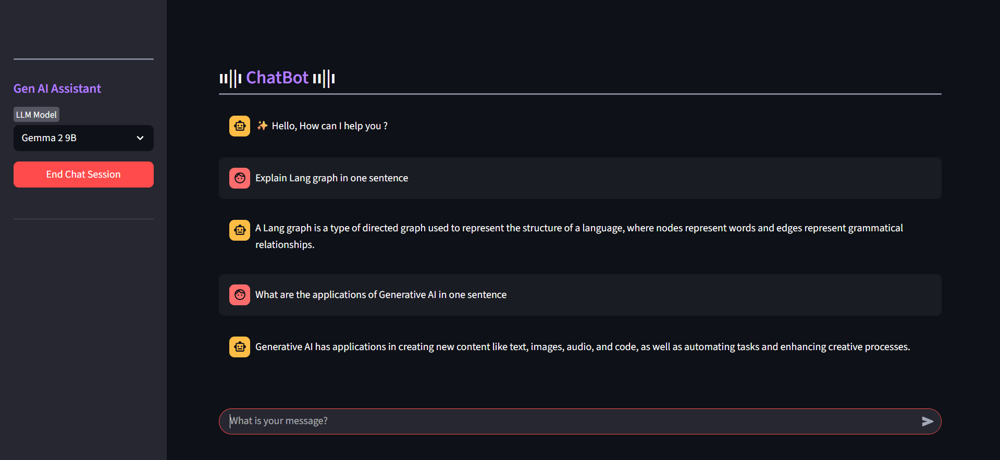

# 🤖 A Streamlit Chatbot with LangGraph and Groq LLM

## 📌Project Overview

### Streamlit Agentic Chatbot Application designed with a modular LangGraph workflow for structured reasoning and contextual awareness.

### **•** Workflow Orchestration : Powered by LangGraph with integrated memory and session tracking for coherent multi-turn conversations.

### **•** Inference & LLM :  Backed by Groq Inference Engine, utilizing the GROQ model for fast and reliable responses.

### **•** User Experience : Streamlit-based interactive UI with session history, clean design, and secure API key management.

# 📸 Bot Screenshot

  

### 1 : Navigate to the project directory
cd streamlit_langgraph_chatbot-main

### 2 : Create a virtual environment
py -m venv .venv

### 3 : Activate the virtual environment (Windows)
.\.venv\Scripts\Activate

### 4 : Upgrade pip
python -m pip install --upgrade pip

### 5 : Install dependencies
pip install streamlit langgraph langchain_groq

### 6 : Run the Streamlit app
streamlit run main.py

